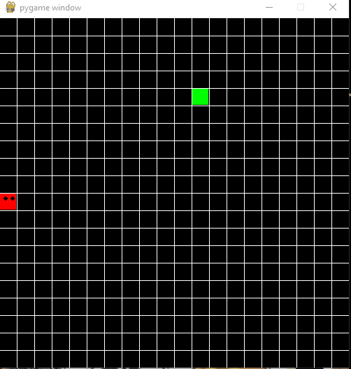

# 🐍 Snake Game - Beta Release


A modern Python implementation of the classic Snake Game using Pygame. This beta release includes core gameplay functionality with planned enhancements coming soon.



## 🚀 Features

✔️ Smooth snake controls with arrow keys  
✔️ Randomized food spawning  
✔️ Growing snake mechanics  
✔️ Wall and self-collision detection  
✔️ Score tracking system  

## 📦 Installation

### Prerequisites
- Python 3.8+
- Pip package manager

### Quick Start
```bash
git clone https://github.com/mariomthree/snake-game.git
cd snake-game
python3 -m venv venv
source venv/bin/activate  # Windows: venv\Scripts\activate
pip install -r requirements.txt  # or pip install pygame
python3 snake.py
```

## 🎮 Controls
| Key | Action |
|-----|--------|
| ← | Move Left |
| → | Move Right |
| ↑ | Move Up |
| ↓ | Move Down |

## 🔧 Development Setup

1. Clone the repository
2. Set up virtual environment
3. Install dependencies:
   ```bash
   pip install -e .[dev]
   ```
4. Run the game:
   ```bash
   python3 snake.py
   ```

## 📅 Roadmap

### Coming in Next Release
- 🌟 Main menu interface
- 📊 High score tracking
- 🎨 Custom game sprites

### Future Plans
- ⚙️ Difficulty settings
- 🎵 Sound effects system
- 🕹️ Game mode variations

## 🤝 Contributing

Contributions are welcome! Please:
1. Fork the repository
2. Create a feature branch
3. Submit a pull request

## 📜 License

MIT License - See [LICENSE](LICENSE) for details.

## 👨‍💻 Author

**Mário M. Mabande**  
[](https://www.linkedin.com/in/mariomthree/)
[](https://twitter.com/mariomthree)
